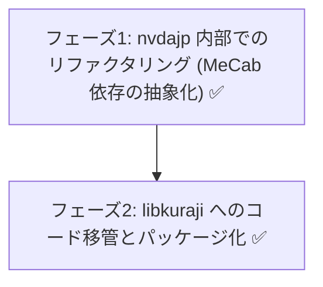

# libkuraji: 日本語点訳エンジンの分離・ライブラリ化計画

**状態（2026-07-06）: フェーズ 1〜3 完了。** 日本語点訳エンジンは独立リポジトリ [nishimotz/libkuraji](https://github.com/nishimotz/libkuraji)（BSD 3-Clause）に分離され、nvdajp はそのベンダーコピーを利用する構成に移行済み。以下は分離前の設計時点の記述を含む（経緯として保持）。現状の詳細は「6. 完了状態のまとめ」を参照。

## 1. 現状の整理（nvdajp と libkuraji の関係）

### 1.1 libkuraji の現在の実体

ness.json`（かな点訳）、`mecabHarness.json`（形態素解析）、`eng2Harness.json`（英語 G2）、`nabccHarness.json`（NABCC）

上記は分離前の結合状態。現在は `translator1.py` / `translator2.py` / `_nvdajp_unicode.py` が薄い互換シムに置き換わっており、呼び出し元（louisHelper.py / jpBrailleViewer.py）は無変更のまま libkuraji に委譲する。

**nvdajp**: libkuraji を依存パッケージ（またはベンダーツリー）として取り込み、`louisHelper.py` / `jpBrailleViewer.py` から呼び出す。JTalk（音声合成）は nvdajp 側に残る。

### ゴール

* **テストの独立化**: libkuraji リポジトリ単体でテストスイートが完結する（テストデータはすでに libkuraji 側にある）。（達成: MeCab 出力の録画・再生方式で 2219 テストが MeCab なしで完結）
* **nvdajp からの結合度排除**: NVDA 固有モジュールへの依存を持ち込まない。（達成）
## 2. 論点: JTalk と libkuraji はどう分離できるか

### 案 A: 形態素解析インターフェースによる依存性注入（推奨）

* libkuraji は「形態素解析結果（表層形・読み・品詞のリスト）を受け取る」抽象インターフェースを定義する。
* 課題: 辞書が異なると読み・分かち書き結果が変わる。libkuraji のテストスイートは「JTalk 辞書を注入した構成」を基準にするか、辞書差分を許容するテスト設計が必要。
* `mecab.py` と辞書ビルド（`jptools` の辞書関連）を libkuraji 側へ移し、JTalk（音声合成）が libkuraji の MeCab に依存する形に逆転させる。
* 「MeCab ラッパー＋JTalk 辞書」を独立パッケージ（例: python-jtalk 系の再整理）とし、JTalk と libkuraji の両方がそれに依存する。
* 最も筋は良いがリポジトリが 3 つになり運用コストが高い。まず案 A で始め、必要になったら C へ発展させるのが現実的。

**採用・実装済み**: 案 A。libkuraji 本体（`translator2.py`）は形態素解析器非依存で、`analyzer.analyze(text, logwrite) -> list[str]` / `is_ready() -> bool` の 2 メソッドを注入する形になっている。nvdajp 側は `mecabAnalyzer.py`（MeCab + JTalk 拡張辞書）を注入。辞書の同一性が必要なテスト（harness.json 経由の分かち書き検証）は、nvdajp 側で録画した MeCab 出力（`tests/mecabFixture.json`、`recordMecabFixture.py` で再録画）を libkuraji 側で再生することで、**MeCab をインストールせずに libkuraji 単体の CI で完結**させている。

**translator2 の真の依存先は MeCab 本体ではなく、JTalk 拡張辞書の出力フォーマットと内容である。** フェーズ 1 で MeCab ライブラリは `mecabAnalyzer.py` に抽象化したが、以下は辞書側の仕様（事実上の API）として残る:

1. **拡張フィールド**: `mecab_to_morphs` は feature 行の第 13 フィールド（`ar[12]`）を「点訳表記」として読む。これは nvdajp が辞書ビルド時に追加した独自フィールドで、標準の ipadic / unidic には存在しない（無い場合は読みフィールドにフォールバックする）。

このため方針を次のとおりとする:

* **参照構成の明記**: libkuraji のテストスイートが保証するのは「JTalk 拡張辞書を注入した構成」のみとする。（実装済み: `tests/mecabFixture.json` が JTalk 拡張辞書構成の録画）
* **辞書の別パッケージ化**: JTalk 辞書（拡張 NAIST-JDIC）は容量が大きいためコードと分離し、ビルド済みバイナリを別パッケージとして配布する。ライセンスは MeCab（BSD 選択可）・NAIST-JDIC（修正 BSD 系）・Open JTalk 拡張（修正 BSD）・nvdajp 拡張（自作）とすべて BSD 系で揃っており、同梱・再配布に法的支障はない。**実施済み（2026-07-06）**: [nishimotz/libkuraji-jtalk-dic](https://github.com/nishimotz/libkuraji-jtalk-dic) を新設し、ビルドレシピ（`make_jdic.py`・NAIST-JDIC ソース・nvdajp 拡張エントリ）を抽出。ユーザー辞書ビルドツール（`build_userdic.py`）も汎用化して同梱（libkuraji/JTalk 双方のユーザーが独自語彙を追加できる）。名称が `libkuraji-dic` ではなく `libkuraji-jtalk-dic` なのは、この辞書が libkuraji 単独の所有物ではなく JTalk（音声合成）と共有する資産であるため。詳細はフェーズ 4 を参照。CI でのフルビルド・GitHub Releases 配布は未着手（残タスク）。
* **他辞書はベストエフォート**: `mecab-python3` + 汎用辞書の注入は「動くが品質保証外」とし、解析器インターフェースの仕様に「点訳表記フィールドはオプション（無ければ読みにフォールバック）」と明記する。
* 点訳専用のカスタムエントリ（`nvdajp-custom-dic`、`nvdajp-tankan-dic` 等の点訳関連分）は libkuraji 側リソースとして管理する。

---

## 3. ライセンス

* libkuraji はすでに **BSD 3-Clause（Copyright 2019,2023 Takuya Nishimoto）** を宣言済みであり、新規リポジトリのライセンス選定は実質決着している。
* 移管対象コードの権利関係:
  * `translator2.py`: Copyright 2012-2023 Takuya Nishimoto（単独）。著作権者本人が BSD で再許諾可能。**実施済み**: 著作権者本人の承諾のもと BSD 3-Clause で libkuraji へ移管した。
  * `translator1.py`: Copyright 2012 Masataka.Shinke, Takuya Nishimoto。**移管ではなく完全な書き直し（クリーンルーム再実装）とする方針**。コード品質の刷新も兼ねる。テストデータ（`harness.json` 等）はすでに libkuraji 側にあり BSD なので、テスト駆動で書き直せる。**実施済み**: 旧コードを一切参照せず、`harness.json`（かな・拗音・外来音・数字・記号・NABCC 等）をテストとして `libkuraji/src/libkuraji/kana.py` を新規作成し、全ケースが一致することを確認した。
  * `mecab.py`（python-jtalk 由来）: 案 A では libkuraji に移さないため当面問題にならない。（変更なし。nvdajp 側の `mecabAnalyzer.py` から引き続き利用）
* 「NVDA の一部」として GPL 配布されてきた経緯があるため、移管時に git 履歴を確認し、第三者パッチ（本家由来コードの流用を含む）が混入していないか監査する。（実施済み。移管は translator2 の単独著作権部分に限定し、翻訳結果はテストスイートで検証済み）

---

## 4. 開発ロードマップ（フェーズ分け）— 全完了

### フェーズ 1: nvdajp 内部での結合度低下（低リスク）— 完了 (PR [#685](https://github.com/nvdajp/nvdajp/pull/685), 2026-07-05)

* translator1/2 の NVDA 固有依存（config、logHandler、ctypes 経由の MeCab 直接呼び出し等）を棚卸しする。
* MeCab 呼び出しを translator2 本体から分離し、形態素データ（リスト）を受け取るインターフェースに変更する（案 A の下準備）。
* 実装: 新規 `source/synthDrivers/jtalk/mecabAnalyzer.py` に MeCab 依存（ctypes の feature 取り出し・`text2mecab`・辞書パス・初期化/ready 判定）を集約。`translator2.initialize(analyzer=...)` で解析器を注入可能にした。

* translator1/2（リファクタリング後）を libkuraji リポジトリへ移し、`pyproject.toml`・CLI エントリポイントを整備する。
* 実装: `kana.py`（クリーンルーム書き直し、harness.json 全464件+NABCC 51件が一致）、`translator2.py`（著作権者の許諾を得て BSD 移管）、`cli.py`（`kuraji` コマンド）、GitHub Actions CI（Ubuntu/Windows × Python 3.10/3.13）。`tests/mecabFixture.json`（nvdajp 側で録画した MeCab 出力の再生）により、MeCab 未インストールでも translator2 のテスト（分かち書き・英語 Grade 1/2）を含めて 2219 件のテストが libkuraji 単体で完結する。旧実装比で分かち書き処理が約 1.9 倍高速化。

* JP smoke tests・点字ユニットテストで回帰がないことを確認する。

* **フェーズ 4.2（完了, 2026-07-06）**: ユーザー辞書ビルドの汎用化。nvdajp 専用だった `build_userdic.py` を汎用ツールとして同梱（`--mecab-dict-index` / `--dic-dir` / `--csv` / `--outfile`）。libkuraji・JTalk 双方のユーザーが、開発環境なしで独自語彙（固有名詞・専門用語）を追加できるようにする土台。エンドツーエンドで検証済み。
* **フェーズ 4.3（完了, 2026-07-06）**: CI での `mecab-dict-index` フルビルド。当初 [nishimotz/libopenjtalk](https://github.com/nishimotz/libopenjtalk) を使う想定だったが、これは nvdajp が実際に使う MeCab ソースとは別系統で、UTF-8 の `rewrite.def` 解析が壊れることが判明したため不採用。nvdajp が実際にビルドしているソース（`miscDepsJp/include/python-jtalk/libopenjtalk/mecab`。Open JTalk フォーク、BSD 系）を `src/mecab-src/` にベンダーし、`.github/workflows/build-dic.yml`（Windows + `ilammy/msvc-dev-cmd`）で `mecab-dict-index.exe` のビルド → 辞書ビルド → ユーザー辞書ビルドまで CI で検証。**教訓**: nvdajp 内には MeCab ソースのコピーが 2 箇所あり（`miscDepsJp/jptools/jtalk/...` と `miscDepsJp/include/python-jtalk/...`）、前者はクリーンビルドすると現行 MSVC で `error C2593`（演算子のあいまいさ）になる古い未使用コピーだった。実際のビルド（`jtalkSync`）は後者（`/D MECAB_STATIC` フラグ付き）をコンパイルしてから前者へコピーしているだけで、nvdajp の実ビルドが「毎回 git clone からでも成立する」という前提を軽視して誤った結論を出しかけた。

* **フェーズ 4.4（完了, 2026-07-06）**: GitHub Releases での配布。`.github/workflows/release-dic.yml` を追加。`v*` タグの push をトリガーに、辞書一式（6 ファイル）を zip 化して SHA256 チェックサムとともに GitHub Release に自動添付する。**公開リポジトリに自動リリース公開の経路を作る操作のため、着手前に利用者へ明示的な許可を確認済み。** 実際のリリース作成（初回タグ push）は未実施。

---

## 5. 関連ドキュメントと参照

* [JTalk 辞書検証の分析 (tab-character-analysis.md)](tab-character-analysis.md)
* [libkuraji リポジトリ](https://github.com/nishimotz/libkuraji)（BSD 3-Clause、点訳エンジン本体）
* [libkuraji-jtalk-dic リポジトリ](https://github.com/nishimotz/libkuraji-jtalk-dic)（BSD 3-Clause、JTalk 拡張辞書のビルドレシピ）
* [ベンダーツリー運用方針 (vendor-submodules.md)](vendor-submodules.md) — 辞書のビルド時取得の方針転換を記載
---

| 項目 | 状態 |
| :--- | :--- |
| libkuraji リポジトリ（BSD 3-Clause, CI 付き） | 完了 |
| kana.py（translator1 相当のクリーンルーム書き直し） | 完了（全 515 テストパス） |
| MeCab 依存の抽象化（`mecabAnalyzer.py`） | 完了 |

| MeCab フィクスチャ再生方式（`mecabFixture.json`） | 完了 |

| `kuraji` CLI | 完了 |
| README（使い方・解析器契約・辞書契約） | 完了 |
| 性能改善（unicode_normalize の translate 化等） | 完了（約 1.9 倍高速化） |
| NABCC モード | 完了 |
| `libkuraji-jtalk-dic`: ビルドレシピ抽出・ユーザー辞書汎用化 | 完了（フェーズ 4.1〜4.2） |
| `libkuraji-jtalk-dic`: CI でのフルビルド | 完了（フェーズ 4.3） |
| `libkuraji-jtalk-dic`: GitHub Releases 配布（ワークフロー） | 完了（フェーズ 4.4）。初回タグ push は未実施 |
| nvdajp `jtalkSync` のプリビルド依存化 | 完了（フェーズ 4.5、`jtalkDicSource=prebuilt`） |

### 残タスク

* **`kuraji` CLI のスタンドアロン化**: フェーズ 4 全体（4.1〜4.5）が完了したことで `kuraji` CLI は nvdajp 抜きでも `libkuraji-jtalk-dic` のビルド済み辞書があれば実際の日本語文（漢字かな交じり文）を点訳できる状態になった。CLI 側に辞書取得の便宜（`--dic-dir` 指定の簡易化やダウンロード補助等）を足すかは今後の任意課題。
* roadmap.md のタスク 2.9b を完了として更新する。
