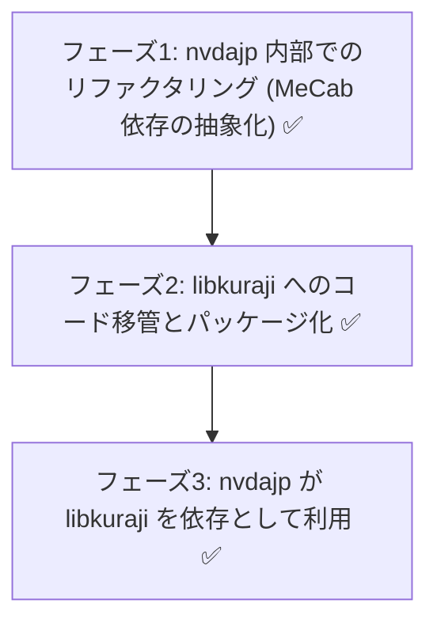

# libkuraji: 日本語点訳エンジンの分離・ライブラリ化計画

**状態（2026-07-06）: フェーズ 1〜3 完了。** 日本語点訳エンジンは独立リポジトリ [nishimotz/libkuraji](https://github.com/nishimotz/libkuraji)（BSD 3-Clause）に分離され、nvdajp はそのベンダーコピーを利用する構成に移行済み。以下は分離前の設計時点の記述を含む（経緯として保持）。現状の詳細は「6. 完了状態のまとめ」を参照。

## 1. 現状の整理（nvdajp と libkuraji の関係）

### 1.1 libkuraji の現在の実体
- `miscDepsJp/include/libkuraji/` はベンダーツリー（subtree 管理）として存在するが、現時点の中身は **BSD 3-Clause の LICENSE とテストデータ（`tests/*.json`）のみ**である。
  - `harness.json`（かな点訳）、`mecabHarness.json`（形態素解析）、`eng2Harness.json`（英語 G2）、`nabccHarness.json`（NABCC）
- つまり libkuraji は「点訳エンジンの独立リポジトリ」という構想の器としてすでに存在するが、**エンジン本体のコードはまだ nvdajp 側にある**。

> 上記は設計当初の状態。現在は libkuraji がエンジン本体（`kana.py` = translator1 相当、`translator2.py`）を含む独立パッケージとして完成し、nvdajp はそのベンダーコピー（`source/libkuraji/`）を利用する。

### 1.2 点訳エンジン本体の所在と結合
- エンジン本体: `source/synthDrivers/jtalk/translator2.py`（Phase 2: 分かち書き・マスあけ）、`translator1.py`（Phase 1: かな→点字）。
- 呼び出し元（nvdajp 側の利用者）は 2 箇所のみ:
  - `source/louisHelper.py`（`translate as jpTranslate`）
  - `source/gui/jpBrailleViewer.py`
- テストランナーは `miscDepsJp/jptools/harness.py` 等で、libkuraji の JSON を読み込んで nvdajp 内のエンジンを検証している。
- 結合の実態:
  - `translator2` は同居する `mecab.py`（python-jtalk 由来の MeCab ラッパー）と JTalk 辞書（`jtalk/dic`）に依存する。
  - NVDA 固有依存（`config`、`logHandler` 等）は translator 本体の import には現れておらず、結合は主に **MeCab／辞書経由**である（詳細はフェーズ 1 で棚卸し）。

> 上記は分離前の結合状態。現在は `translator1.py` / `translator2.py` / `_nvdajp_unicode.py` が薄い互換シムに置き換わっており、呼び出し元（louisHelper.py / jpBrailleViewer.py）は無変更のまま libkuraji に委譲する。

### 1.3 目指す関係
- **libkuraji**: 点訳エンジン（translator1/2 相当）＋テストスイートを持つ独立 Python ライブラリ／CLI。BSD 3-Clause。
- **nvdajp**: libkuraji を依存パッケージ（またはベンダーツリー）として取り込み、`louisHelper.py` / `jpBrailleViewer.py` から呼び出す。JTalk（音声合成）は nvdajp 側に残る。

### ゴール
- **ライブラリ化**: `pip install` 等で導入でき、任意の Python プロジェクトから呼び出せる。（達成: `pip install git+https://github.com/nishimotz/libkuraji.git`）
- **CLI ツール化**: `echo "テキスト" | kuraji` のように点訳結果を得られる。（達成）
- **テストの独立化**: libkuraji リポジトリ単体でテストスイートが完結する（テストデータはすでに libkuraji 側にある）。（達成: MeCab 出力の録画・再生方式で 2219 テストが MeCab なしで完結）
- **nvdajp からの結合度排除**: NVDA 固有モジュールへの依存を持ち込まない。（達成）

---

## 2. 論点: JTalk と libkuraji はどう分離できるか

translator2 が `synthDrivers/jtalk/` に同居している理由は、MeCab ラッパーと JTalk 辞書（拡張 NAIST-JDIC）を音声合成と共用しているためである。分離の設計選択肢:

### 案 A: 形態素解析インターフェースによる依存性注入（推奨）
- libkuraji は「形態素解析結果（表層形・読み・品詞のリスト）を受け取る」抽象インターフェースを定義する。
- nvdajp 組み込み時は、JTalk 側の `mecab.py` ＋ JTalk 辞書をアダプター経由で注入する（辞書・DLL の二重持ちなし、読み・マスあけの挙動も現行と一致）。
- スタンドアロン利用時は `mecab-python3` ＋ `unidic-lite`/`ipadic` 等を optional dependency として利用する。
- 課題: 辞書が異なると読み・分かち書き結果が変わる。libkuraji のテストスイートは「JTalk 辞書を注入した構成」を基準にするか、辞書差分を許容するテスト設計が必要。

### 案 B: MeCab ラッパー＋辞書ごと libkuraji に移す
- `mecab.py` と辞書ビルド（`jptools` の辞書関連）を libkuraji 側へ移し、JTalk（音声合成）が libkuraji の MeCab に依存する形に逆転させる。
- 利点: 点訳の再現性が完全。欠点: 音声合成が点訳ライブラリに依存するのは不自然で、辞書（大容量）の配布問題を libkuraji が抱え込む。

### 案 C: MeCab 層を第三のパッケージに分離
- 「MeCab ラッパー＋JTalk 辞書」を独立パッケージ（例: python-jtalk 系の再整理）とし、JTalk と libkuraji の両方がそれに依存する。
- 最も筋は良いがリポジトリが 3 つになり運用コストが高い。まず案 A で始め、必要になったら C へ発展させるのが現実的。

**採用・実装済み**: 案 A。libkuraji 本体（`translator2.py`）は形態素解析器非依存で、`analyzer.analyze(text, logwrite) -> list[str]` / `is_ready() -> bool` の 2 メソッドを注入する形になっている。nvdajp 側は `mecabAnalyzer.py`（MeCab + JTalk 拡張辞書）を注入。辞書の同一性が必要なテスト（harness.json 経由の分かち書き検証）は、nvdajp 側で録画した MeCab 出力（`tests/mecabFixture.json`、`recordMecabFixture.py` で再録画）を libkuraji 側で再生することで、**MeCab をインストールせずに libkuraji 単体の CI で完結**させている。

### 辞書アセットの扱いと「辞書契約」

**translator2 の真の依存先は MeCab 本体ではなく、JTalk 拡張辞書の出力フォーマットと内容である。** フェーズ 1 で MeCab ライブラリは `mecabAnalyzer.py` に抽象化したが、以下は辞書側の仕様（事実上の API）として残る:

1. **拡張フィールド**: `mecab_to_morphs` は feature 行の第 13 フィールド（`ar[12]`）を「点訳表記」として読む。これは nvdajp が辞書ビルド時に追加した独自フィールドで、標準の ipadic / unidic には存在しない（無い場合は読みフィールドにフォールバックする）。
2. **読みの規約**: カタカナ読み、アクセント欄の `0/1` 形式、`’` を含む長音処理など、translator2 のルールは JTalk 辞書固有の出力に合わせてチューニングされている。
3. **テストの前提**: `libkuraji/tests/harness.json` の期待値自体が JTalk 辞書の読み・分かち書きを前提としており、辞書を替えると正解が変わる。

このため方針を次のとおりとする:

- **参照構成の明記**: libkuraji のテストスイートが保証するのは「JTalk 拡張辞書を注入した構成」のみとする。（実装済み: `tests/mecabFixture.json` が JTalk 拡張辞書構成の録画）
- **辞書の別パッケージ化**: JTalk 辞書（拡張 NAIST-JDIC）は容量が大きいためコードと分離し、ビルド済みバイナリを別パッケージ（例: `libkuraji-dic`）として配布する。ライセンスは MeCab（BSD 選択可）・NAIST-JDIC（修正 BSD 系）・Open JTalk 拡張（修正 BSD）・nvdajp 拡張（自作）とすべて BSD 系で揃っており、同梱・再配布に法的支障はない。（**未着手**: CLI をスタンドアロンで使う場合の残タスク。現状は nvdajp 組み込み構成でのみ辞書入りで動作する）
- **他辞書はベストエフォート**: `mecab-python3` + 汎用辞書の注入は「動くが品質保証外」とし、解析器インターフェースの仕様に「点訳表記フィールドはオプション（無ければ読みにフォールバック）」と明記する。
- 点訳専用のカスタムエントリ（`nvdajp-custom-dic`、`nvdajp-tankan-dic` 等の点訳関連分）は libkuraji 側リソースとして管理する。

---

## 3. ライセンス

- libkuraji はすでに **BSD 3-Clause（Copyright 2019,2023 Takuya Nishimoto）** を宣言済みであり、新規リポジトリのライセンス選定は実質決着している。
- 移管対象コードの権利関係:
  - `translator2.py`: Copyright 2012-2023 Takuya Nishimoto（単独）。著作権者本人が BSD で再許諾可能。**実施済み**: 著作権者本人の承諾のもと BSD 3-Clause で libkuraji へ移管した。
  - `translator1.py`: Copyright 2012 Masataka.Shinke, Takuya Nishimoto。**移管ではなく完全な書き直し（クリーンルーム再実装）とする方針**。コード品質の刷新も兼ねる。テストデータ（`harness.json` 等）はすでに libkuraji 側にあり BSD なので、テスト駆動で書き直せる。**実施済み**: 旧コードを一切参照せず、`harness.json`（かな・拗音・外来音・数字・記号・NABCC 等）をテストとして `libkuraji/src/libkuraji/kana.py` を新規作成し、全ケースが一致することを確認した。
  - `mecab.py`（python-jtalk 由来）: 案 A では libkuraji に移さないため当面問題にならない。（変更なし。nvdajp 側の `mecabAnalyzer.py` から引き続き利用）
- 「NVDA の一部」として GPL 配布されてきた経緯があるため、移管時に git 履歴を確認し、第三者パッチ（本家由来コードの流用を含む）が混入していないか監査する。（実施済み。移管は translator2 の単独著作権部分に限定し、翻訳結果はテストスイートで検証済み）

---

## 4. 開発ロードマップ（フェーズ分け）— 全完了

### フェーズ 1: nvdajp 内部での結合度低下（低リスク）— 完了 (PR [#685](https://github.com/nvdajp/nvdajp/pull/685), 2026-07-05)
- translator1/2 の NVDA 固有依存（config、logHandler、ctypes 経由の MeCab 直接呼び出し等）を棚卸しする。
- MeCab 呼び出しを translator2 本体から分離し、形態素データ（リスト）を受け取るインターフェースに変更する（案 A の下準備）。
- 現行の harness テスト（`jptools/harness.py` 等）が引き続き通ることを CI で確認する。
- 実装: 新規 `source/synthDrivers/jtalk/mecabAnalyzer.py` に MeCab 依存（ctypes の feature 取り出し・`text2mecab`・辞書パス・初期化/ready 判定）を集約。`translator2.initialize(analyzer=...)` で解析器を注入可能にした。

### フェーズ 2: libkuraji リポジトリへの移管とパッケージ化 — 完了 (2026-07-05, [nishimotz/libkuraji](https://github.com/nishimotz/libkuraji))
- translator1/2（リファクタリング後）を libkuraji リポジトリへ移し、`pyproject.toml`・CLI エントリポイントを整備する。
- テストランナー（現 `jptools/*Harness.py` 相当）も libkuraji へ移し、単体で完結させる。
- translator1 相当（かな→点字）は移管せず、libkuraji 側で新規に書き直す（`harness.json` をテストとして先に通す）。
- 実装: `kana.py`（クリーンルーム書き直し、harness.json 全464件+NABCC 51件が一致）、`translator2.py`（著作権者の許諾を得て BSD 移管）、`cli.py`（`kuraji` コマンド）、GitHub Actions CI（Ubuntu/Windows × Python 3.10/3.13）。`tests/mecabFixture.json`（nvdajp 側で録画した MeCab 出力の再生）により、MeCab 未インストールでも translator2 のテスト（分かち書き・英語 Grade 1/2）を含めて 2219 件のテストが libkuraji 単体で完結する。旧実装比で分かち書き処理が約 1.9 倍高速化。

### フェーズ 3: nvdajp からの利用切り替え — 完了 (PR [#686](https://github.com/nvdajp/nvdajp/pull/686), 2026-07-06)
- `synthDrivers/jtalk/translator1.py` / `translator2.py` を削除し、libkuraji（subtree 更新または pip 依存）に置き換える。
- `louisHelper.py` と `gui/jpBrailleViewer.py` の import を切り替え、JTalk の `mecab.py` をアダプターとして注入する。
- JP smoke tests・点字ユニットテストで回帰がないことを確認する。
- 実装: libkuraji を `source/libkuraji/` にベンダーコピー（`miscDepsJp/jptools/syncLibkuraji.py` で同期。libkuraji が正、nvdajp への一方向コピー）。`translator1.py` / `translator2.py` / `_nvdajp_unicode.py` は薄い互換シムに置換し、`louisHelper.py` 等の呼び出し元は無変更のまま維持。
- **教訓**: 分離作業で `kana.py` が harness.json のカバー範囲外の文字（ヘブライ文字等）を読み飛ばす退行が発生し、点字カーソルのルーティング（1 入力文字 = 1 出力セルの位置対応）が壊れた。原因は旧 `translator1.py` が未知文字を `□` プレースホルダーとして 1:1 対応を保っていたのに対し、書き直し版が単純にスキップしていたこと。nvdajp の既定点字テーブル `ja-jp-comp6.utb` は全テキストが translator2 経由になる（`louisHelper.py` の JP パッチ）ため、日本語以外のテキストでも回帰が波及する。libkuraji 側で `d9f662f` により修正済み。**クリーンルーム書き直しの際は、テストコーパスに無い入力（他言語スクリプト等）のフォールバック挙動を旧実装と突き合わせる**ことが必要。

---

## 5. 関連ドキュメントと参照
- [日本語点字出力テーブルの実装詳細 (braille-ja-jp-comp6.md)](braille-ja-jp-comp6.md)
- [日本語点字テーブルの関係整理 (braille-tables-relationship.md)](braille-tables-relationship.md)
- [JTalk 辞書検証の分析 (tab-character-analysis.md)](tab-character-analysis.md)
- [ユーザー辞書とツールの x64 化 (userdic.md)](userdic.md)
- [libkuraji リポジトリ](https://github.com/nishimotz/libkuraji)（BSD 3-Clause、点訳エンジン本体）

---

## 6. 完了状態のまとめ（2026-07-06 時点）

| 項目 | 状態 |
| :--- | :--- |
| libkuraji リポジトリ（BSD 3-Clause, CI 付き） | 完了 |
| kana.py（translator1 相当のクリーンルーム書き直し） | 完了（全 515 テストパス） |
| translator2 の BSD 移管 | 完了（著作権者許諾済み） |
| MeCab 依存の抽象化（`mecabAnalyzer.py`） | 完了 |
| nvdajp のベンダー切替え（`source/libkuraji/`） | 完了 |
| MeCab フィクスチャ再生方式（`mecabFixture.json`） | 完了 |
| `kuraji` CLI | 完了 |
| README（使い方・解析器契約・辞書契約） | 完了 |
| 性能改善（unicode_normalize の translate 化等） | 完了（約 1.9 倍高速化） |
| **`libkuraji-dic`（辞書の別パッケージ化）** | **未着手** — CLI をスタンドアロンで使う際の残タスク |
| NABCC モード | 完了 |

### 残タスク
- **`libkuraji-dic`**: JTalk 拡張辞書のビルド済みバイナリを別パッケージとして GitHub Releases 等で配布し、`kuraji` CLI が nvdajp 抜きでも実際の日本語文（漢字かな交じり文）を点訳できるようにする。現状は nvdajp に組み込んだ構成でのみ辞書入りで動作する。
- roadmap.md のタスク 2.9 を完了として更新する。
