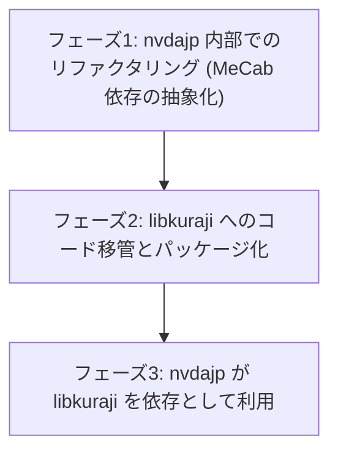

# libkuraji: 日本語点訳エンジンの分離・ライブラリ化計画

## 1. 現状の整理（nvdajp と libkuraji の関係）

### 1.1 libkuraji の現在の実体
- `miscDepsJp/include/libkuraji/` はベンダーツリー（subtree 管理）として存在するが、現時点の中身は **BSD 3-Clause の LICENSE とテストデータ（`tests/*.json`）のみ**である。
  - `harness.json`（かな点訳）、`mecabHarness.json`（形態素解析）、`eng2Harness.json`（英語 G2）、`nabccHarness.json`（NABCC）
- つまり libkuraji は「点訳エンジンの独立リポジトリ」という構想の器としてすでに存在するが、**エンジン本体のコードはまだ nvdajp 側にある**。

### 1.2 点訳エンジン本体の所在と結合
- エンジン本体: `source/synthDrivers/jtalk/translator2.py`（Phase 2: 分かち書き・マスあけ）、`translator1.py`（Phase 1: かな→点字）。
- 呼び出し元（nvdajp 側の利用者）は 2 箇所のみ:
  - `source/louisHelper.py`（`translate as jpTranslate`）
  - `source/gui/jpBrailleViewer.py`
- テストランナーは `miscDepsJp/jptools/harness.py` 等で、libkuraji の JSON を読み込んで nvdajp 内のエンジンを検証している。
- 結合の実態:
  - `translator2` は同居する `mecab.py`（python-jtalk 由来の MeCab ラッパー）と JTalk 辞書（`jtalk/dic`）に依存する。
  - NVDA 固有依存（`config`、`logHandler` 等）は translator 本体の import には現れておらず、結合は主に **MeCab／辞書経由**である（詳細はフェーズ 1 で棚卸し）。

### 1.3 目指す関係
- **libkuraji**: 点訳エンジン（translator1/2 相当）＋テストスイートを持つ独立 Python ライブラリ／CLI。BSD 3-Clause。
- **nvdajp**: libkuraji を依存パッケージ（またはベンダーツリー）として取り込み、`louisHelper.py` / `jpBrailleViewer.py` から呼び出す。JTalk（音声合成）は nvdajp 側に残る。

### ゴール
- **ライブラリ化**: `pip install` 等で導入でき、任意の Python プロジェクトから呼び出せる。
- **CLI ツール化**: `echo "テキスト" | kuraji` のように点訳結果を得られる。
- **テストの独立化**: libkuraji リポジトリ単体でテストスイートが完結する（テストデータはすでに libkuraji 側にある）。
- **nvdajp からの結合度排除**: NVDA 固有モジュールへの依存を持ち込まない。

---

## 2. 論点: JTalk と libkuraji はどう分離できるか

translator2 が `synthDrivers/jtalk/` に同居している理由は、MeCab ラッパーと JTalk 辞書（拡張 NAIST-JDIC）を音声合成と共用しているためである。分離の設計選択肢:

### 案 A: 形態素解析インターフェースによる依存性注入（推奨）
- libkuraji は「形態素解析結果（表層形・読み・品詞のリスト）を受け取る」抽象インターフェースを定義する。
- nvdajp 組み込み時は、JTalk 側の `mecab.py` ＋ JTalk 辞書をアダプター経由で注入する（辞書・DLL の二重持ちなし、読み・マスあけの挙動も現行と一致）。
- スタンドアロン利用時は `mecab-python3` ＋ `unidic-lite`/`ipadic` 等を optional dependency として利用する。
- 課題: 辞書が異なると読み・分かち書き結果が変わる。libkuraji のテストスイートは「JTalk 辞書を注入した構成」を基準にするか、辞書差分を許容するテスト設計が必要。

### 案 B: MeCab ラッパー＋辞書ごと libkuraji に移す
- `mecab.py` と辞書ビルド（`jptools` の辞書関連）を libkuraji 側へ移し、JTalk（音声合成）が libkuraji の MeCab に依存する形に逆転させる。
- 利点: 点訳の再現性が完全。欠点: 音声合成が点訳ライブラリに依存するのは不自然で、辞書（大容量）の配布問題を libkuraji が抱え込む。

### 案 C: MeCab 層を第三のパッケージに分離
- 「MeCab ラッパー＋JTalk 辞書」を独立パッケージ（例: python-jtalk 系の再整理）とし、JTalk と libkuraji の両方がそれに依存する。
- 最も筋は良いがリポジトリが 3 つになり運用コストが高い。まず案 A で始め、必要になったら C へ発展させるのが現実的。

**当面の方針**: 案 A。libkuraji 本体は形態素解析器非依存とし、辞書の同一性が必要なテスト（harness.json）は「JTalk 辞書注入構成」で nvdajp CI からも実行する。

### 辞書アセットの扱い
- JTalk 辞書（拡張 NAIST-JDIC）は容量が大きいためコードパッケージと分離し、別パッケージ化またはビルド／ダウンロード方式とする。
- 点訳専用のカスタムエントリ（`nvdajp-custom-dic`、`nvdajp-tankan-dic` 等の点訳関連分）は libkuraji 側リソースとして同梱する。

---

## 3. ライセンス

- libkuraji はすでに **BSD 3-Clause（Copyright 2019,2023 Takuya Nishimoto）** を宣言済みであり、新規リポジトリのライセンス選定は実質決着している。
- 移管対象コードの権利関係:
  - `translator2.py`: Copyright 2012-2023 Takuya Nishimoto（単独）。著作権者本人が BSD で再許諾可能。
  - `translator1.py`: Copyright 2012 Masataka.Shinke, Takuya Nishimoto。**移管ではなく完全な書き直し（クリーンルーム再実装）とする方針**。コード品質の刷新も兼ねる。テストデータ（`harness.json` 等）はすでに libkuraji 側にあり BSD なので、テスト駆動で書き直せる。
  - `mecab.py`（python-jtalk 由来）: 案 A では libkuraji に移さないため当面問題にならない。
- 「NVDA の一部」として GPL 配布されてきた経緯があるため、移管時に git 履歴を確認し、第三者パッチ（本家由来コードの流用を含む）が混入していないか監査する。

---

## 4. 開発ロードマップ（フェーズ分け）

### フェーズ 1: nvdajp 内部での結合度低下（低リスク）
- translator1/2 の NVDA 固有依存（config、logHandler、ctypes 経由の MeCab 直接呼び出し等）を棚卸しする。
- MeCab 呼び出しを translator2 本体から分離し、形態素データ（リスト）を受け取るインターフェースに変更する（案 A の下準備）。
- 現行の harness テスト（`jptools/harness.py` 等）が引き続き通ることを CI で確認する。

### フェーズ 2: libkuraji リポジトリへの移管とパッケージ化
- translator1/2（リファクタリング後）を libkuraji リポジトリへ移し、`pyproject.toml`・CLI エントリポイントを整備する。
- テストランナー（現 `jptools/*Harness.py` 相当）も libkuraji へ移し、単体で完結させる。
- translator1 相当（かな→点字）は移管せず、libkuraji 側で新規に書き直す（`harness.json` をテストとして先に通す）。

### フェーズ 3: nvdajp からの利用切り替え
- `synthDrivers/jtalk/translator1.py` / `translator2.py` を削除し、libkuraji（subtree 更新または pip 依存）に置き換える。
- `louisHelper.py` と `gui/jpBrailleViewer.py` の import を切り替え、JTalk の `mecab.py` をアダプターとして注入する。
- JP smoke tests・点字ユニットテストで回帰がないことを確認する。

---

## 5. 関連ドキュメントと参照
- [日本語点字出力テーブルの実装詳細 (braille-ja-jp-comp6.md)](braille-ja-jp-comp6.md)
- [日本語点字テーブルの関係整理 (braille-tables-relationship.md)](braille-tables-relationship.md)
- [JTalk 辞書検証の分析 (tab-character-analysis.md)](tab-character-analysis.md)
- [ユーザー辞書とツールの x64 化 (userdic.md)](userdic.md)
